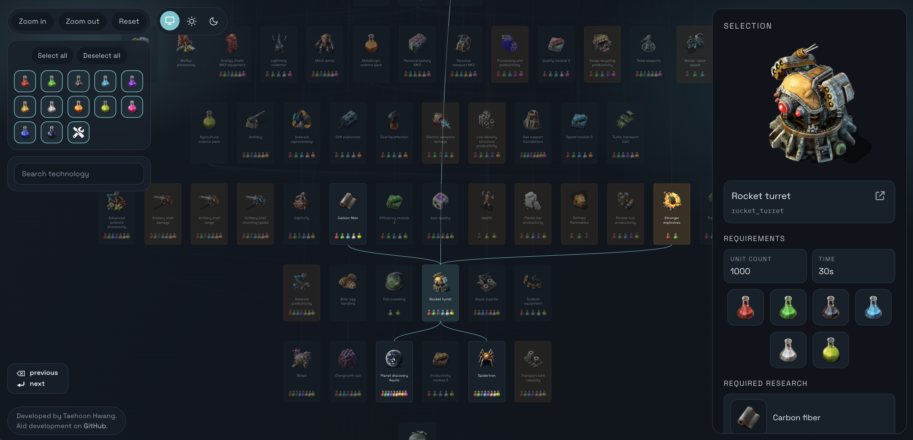

# Factorio Tech Tree

An interactive Factorio tech tree explorer with a companion crawler that pulls data from the Factorio Wiki.



## Repo layout
| Path | Description |
| --- | --- |
| `crawler/` | Python crawler that scrapes the Factorio Wiki and exports `tech_tree.jsonl`. |
| `factorio-tech-tree/` | Next.js app that renders the tech tree from JSONL and images. |

## Viewing the App

You can access the app [here](https://factorio-tech-tree.com/).

## Updating the Data
The crawler writes JSONL data that the app loads from `factorio-tech-tree/data/tech_tree.jsonl`.

```bash
cd crawler
python -m venv .venv
source .venv/bin/activate
pip install requests beautifulsoup4

python main.py --output-jsonl ../factorio-tech-tree/data/tech_tree.jsonl
```

## Data Notes
- Tech data lives in `factorio-tech-tree/data/tech_tree.jsonl`.
- Tech images live in `factorio-tech-tree/data/tech_images` and are served via `/api/tech-image`.
