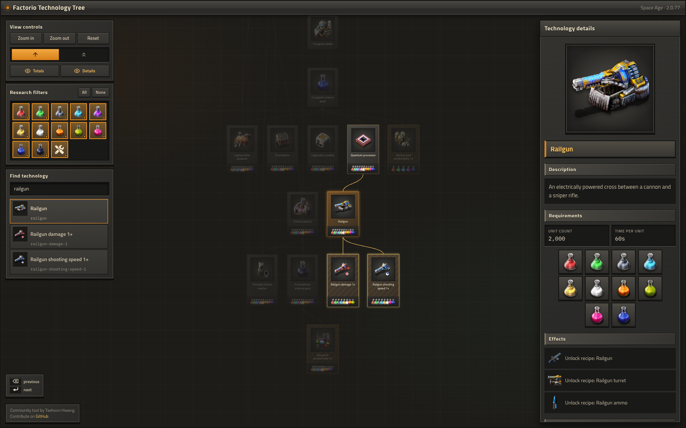

# Factorio Tech Tree

An interactive technology tree built from the installed Factorio game, with English descriptions, research costs, prerequisites, effects, and original game icons.

[Open the website](https://factorio-tech-tree.com/)



## Development

Requires Node.js 22 or newer. Run all commands from the repository root:

```bash
npm ci
npm run dev
```

The generated dataset and icons are committed. Developing, testing, and building the website do not require Factorio, Steam, Python, or access to the Wiki.

```bash
npm test
npm run typecheck
npm run lint
npm run build
```

## Updating game data

Install Factorio with Space Age, then run:

```bash
npm run data:generate
```

On macOS the gatherer defaults to the Steam installation at:

```text
~/Library/Application Support/Steam/steamapps/common/Factorio/factorio.app/Contents/MacOS/factorio
```

To use another macOS installation, pass the executable explicitly:

```bash
npm run data:generate -- --factorio "/path/to/factorio.app/Contents/MacOS/factorio"
```

`FACTORIO_BIN` also overrides the executable. The gatherer targets the macOS app layout; other operating systems are not currently supported.

It runs Factorio's `--dump-data`, `--dump-prototype-locale`, and `--dump-icon-sprites` commands in an isolated directory at `.cache/factorio-export/`. Only `base`, `elevated-rails`, `quality`, and `space-age` are enabled, with English localization and default startup settings. Saves and your personal configuration/mod directory are never read or modified. The graphical icon export requires a desktop session and, for the Steam build, Steam. It may briefly open a game window.

To reprocess the last successful exports without launching Factorio:

```bash
npm run data:generate -- --reuse-exports
```

Cached exports must match the recorded profile and source hashes. To refresh after a game update, run without `--reuse-exports`. Full dumps, logs, Steam bootstrap files, and temporary files remain ignored in `.cache/`.

The gatherer validates every technology, prerequisite, research cost, trigger, effect reference, and selected PNG before replacing website data. Unknown effects or triggers fail explicitly. After generation, run the checks above and review the data/asset diff.

## Repository layout

| Path | Purpose |
| --- | --- |
| `app/` | Next.js technology graph and details panel |
| `data-gatherer/` | TypeScript export runner, normalization, and tests |
| `data/tech_tree.jsonl` | Normalized research data |
| `data/manifest.json` | Game version, mod profile, input hashes, description counts, and science-pack metadata |
| `public/data/` | Selected exported technology, science-pack, recipe, quality, and location icons |

## Data contract

The current profile is unmodded Factorio + Space Age in English. It represents the game's prototype defaults, not the progress, difficulty settings, or script-driven changes in a save.

- IDs are native prototype names. Dependencies come exclusively from `prerequisites`; outgoing edges are derived from them.
- Research uses either numeric science costs (or a separate `count_formula`) or a structured `research_trigger`.
- Research levels and infinite status are explicit. Infinite research does not create a self-dependency. Formula-based and repeatable research is excluded from finite ancestor cost totals.
- Descriptions come from Factorio's resolved English locale. Rich-text references become localized names. When a technology has no description, a factual summary is built from its visible effects and marked with `description_source: "effects"`.
- Effects retain their native type, targets, and modifiers, with display text and applicable icons. Hidden effects remain in the dataset but are omitted from the details panel.
- Hidden technologies and disabled technologies that are not marked visible are omitted from the graph. A visible technology depending on one fails explicitly rather than silently dropping an edge.
- Graph depth (`level`) is computed separately from the technology's research level (`research_level`).

Generation is deterministic for identical exports; the manifest records input hashes instead of changing timestamps. All selected icons are validated as square PNGs, with at least 256 pixels for technologies and 64 pixels for other icons.

## Deployment

The Next.js application and package files are at the repository root. Configure hosting to use the repository root (not the former nested `factorio-tech-tree/` directory), with `npm run build`. Deployments consume committed data; do not run the gatherer during a hosting build.

Factorio game data and graphics belong to Wube Software. The repository's MIT license applies to the project code, not to the imported game assets. This is an unofficial fan project.
